# Prisma Schema Reference

## User

**Purpose**: Represents the User entity in the system.

### Fields

| Field | Type | Required | Default | Unique | Relations / Constraints |
|---|---|---|---|---|---|
| `id` | `String` | Yes | `uuid(` | No |  `@id` |
| `uuid` | `String` | Yes | `uuid(` | Yes |   |
| `email` | `String` | Yes | - | Yes |   |
| `password` | `String` | Yes | - | No |   |
| `role` | `UserRole` | Yes | - | No |   |
| `status` | `String` | Yes | `"ACTIVE"` | No |   |
| `is_verified` | `Boolean` | Yes | `false` | No |   |
| `last_login` | `DateTime?` | No | - | No |   |
| `first_name` | `String?` | No | - | No |   |
| `last_name` | `String?` | No | - | No |   |
| `phone` | `String?` | No | - | No |   |
| `avatar` | `String?` | No | - | No |   |
| `bank_details` | `Json?` | No | - | No |   |
| `created_at` | `DateTime` | Yes | `now(` | No |   |
| `updated_at` | `DateTime` | Yes | - | No |   |
| `is_deleted` | `Boolean` | Yes | `false` | No |   |
| `deleted_at` | `DateTime?` | No | - | No |   |
| `deleted_by` | `String?` | No | - | No |   |
| `customer` | `Customer?` | No | - | No |   |
| `driver` | `Driver?` | No | - | No |   |
| `fleet_owner` | `FleetOwner?` | No | - | No |   |
| `plant_owner` | `PlantOwner?` | No | - | No |   |
| `broker` | `Broker?` | No | - | No |   |
| `admin` | `Admin?` | No | - | No |   |
| `wallets` | `Wallet[]` | No | - | No |   |
| `audit_logs` | `ActivityLog[]` | No | - | No |   |
| `approved_drivers` | `DriverApproval[]` | No | - | No | `@relation("ApprovedByUser")`  |
| `driver_status_history` | `DriverStatusHistory[]` | No | - | No | `@relation("StatusChangedByUser")`  |

### Enums
- **UserRole**: ADMIN, SUPER_ADMIN, CUSTOMER, DRIVER, FLEET_OWNER, PLANT_OWNER, BROKER

### Indexes & Constraints
- None at table level

### Mapped Table Name
- `users`

### Prisma Query Examples

```javascript
// Create
const newUser = await prisma.user.create({
  data: {
    // Required fields here
  }
});

// Find
const foundUser = await prisma.user.findUnique({
  where: { id: 'some-uuid' }
});

// Update
const updatedUser = await prisma.user.update({
  where: { id: 'some-uuid' },
  data: {
    // Update fields
  }
});

// Delete
const deletedUser = await prisma.user.delete({
  where: { id: 'some-uuid' }
});
```

---

## Customer

**Purpose**: Represents the Customer entity in the system.

### Fields

| Field | Type | Required | Default | Unique | Relations / Constraints |
|---|---|---|---|---|---|
| `id` | `String` | Yes | `uuid(` | No |  `@id` |
| `user_id` | `String` | Yes | - | Yes |   |
| `user` | `User` | Yes | - | No | `@relation(fields: [user_id], references: [id])`  |
| `company_name` | `String?` | No | - | No |   |
| `tax_number` | `String?` | No | - | No |   |
| `created_at` | `DateTime` | Yes | `now(` | No |   |
| `updated_at` | `DateTime` | Yes | - | No |   |
| `is_deleted` | `Boolean` | Yes | `false` | No |   |
| `deleted_at` | `DateTime?` | No | - | No |   |
| `deleted_by` | `String?` | No | - | No |   |
| `bookings` | `Booking[]` | No | - | No |   |
| `invoices` | `Invoice[]` | No | - | No |   |

### Enums
- None

### Indexes & Constraints
- None at table level

### Mapped Table Name
- `customers`

### Prisma Query Examples

```javascript
// Create
const newCustomer = await prisma.customer.create({
  data: {
    // Required fields here
  }
});

// Find
const foundCustomer = await prisma.customer.findUnique({
  where: { id: 'some-uuid' }
});

// Update
const updatedCustomer = await prisma.customer.update({
  where: { id: 'some-uuid' },
  data: {
    // Update fields
  }
});

// Delete
const deletedCustomer = await prisma.customer.delete({
  where: { id: 'some-uuid' }
});
```

---

## Driver

**Purpose**: Represents the Driver entity in the system.

### Fields

| Field | Type | Required | Default | Unique | Relations / Constraints |
|---|---|---|---|---|---|
| `id` | `String` | Yes | `uuid(` | No |  `@id` |
| `user_id` | `String` | Yes | - | Yes |   |
| `user` | `User` | Yes | - | No | `@relation(fields: [user_id], references: [id])`  |
| `status` | `String` | Yes | `"AVAILABLE"` | No |   |
| `license` | `String?` | No | - | Yes |   |
| `pdp` | `String?` | No | - | No |   |
| `id_document` | `String?` | No | - | No |   |
| `fleet_owner_id` | `String?` | No | - | No |   |
| `fleet_owner` | `FleetOwner?` | No | - | No | `@relation(fields: [fleet_owner_id], references: [id])`  |
| `assigned_vehicle_id` | `String?` | No | - | No |   |
| `assigned_vehicle` | `Vehicle?` | No | - | No | `@relation(fields: [assigned_vehicle_id], references: [id])`  |
| `license_expiry` | `DateTime?` | No | - | No |   |
| `driving_category` | `String?` | No | - | No |   |
| `national_id` | `String?` | No | - | No |   |
| `address` | `String?` | No | - | No |   |
| `emergency_contact` | `Json?` | No | - | No |   |
| `documents` | `Json?` | No | - | No |   |
| `created_at` | `DateTime` | Yes | `now(` | No |   |
| `updated_at` | `DateTime` | Yes | - | No |   |
| `is_deleted` | `Boolean` | Yes | `false` | No |   |
| `deleted_at` | `DateTime?` | No | - | No |   |
| `deleted_by` | `String?` | No | - | No |   |
| `applications` | `DriverApplication[]` | No | - | No |   |
| `assignments` | `BookingAssignment[]` | No | - | No |   |
| `profile` | `DriverProfile?` | No | - | No |   |
| `photos` | `DriverPhoto?` | No | - | No |   |
| `documents_relation` | `DriverDocuments?` | No | - | No |   |
| `vehicle_relation` | `DriverVehicle?` | No | - | No |   |
| `kyc` | `DriverKYC?` | No | - | No |   |
| `approval` | `DriverApproval?` | No | - | No |   |
| `status_history` | `DriverStatusHistory[]` | No | - | No |   |

### Enums
- None

### Indexes & Constraints
- None at table level

### Mapped Table Name
- `drivers`

### Prisma Query Examples

```javascript
// Create
const newDriver = await prisma.driver.create({
  data: {
    // Required fields here
  }
});

// Find
const foundDriver = await prisma.driver.findUnique({
  where: { id: 'some-uuid' }
});

// Update
const updatedDriver = await prisma.driver.update({
  where: { id: 'some-uuid' },
  data: {
    // Update fields
  }
});

// Delete
const deletedDriver = await prisma.driver.delete({
  where: { id: 'some-uuid' }
});
```

---

## FleetOwner

**Purpose**: Represents the FleetOwner entity in the system.

### Fields

| Field | Type | Required | Default | Unique | Relations / Constraints |
|---|---|---|---|---|---|
| `id` | `String` | Yes | `uuid(` | No |  `@id` |
| `user_id` | `String` | Yes | - | Yes |   |
| `user` | `User` | Yes | - | No | `@relation(fields: [user_id], references: [id])`  |
| `company_name` | `String?` | No | - | No |   |
| `status` | `String` | Yes | `"REGISTERED"` | No |   |
| `company_documents` | `Json?` | No | - | No |   |
| `vat_number` | `String?` | No | - | No |   |
| `num_vehicles` | `Int?` | No | - | No |   |
| `fleet_tier` | `String?` | No | - | No |   |
| `operating_areas` | `String?` | No | - | No |   |
| `services_offered` | `String?` | No | - | No |   |
| `notes` | `String?` | No | - | No |   |
| `address` | `String?` | No | - | No |   |
| `created_at` | `DateTime` | Yes | `now(` | No |   |
| `updated_at` | `DateTime` | Yes | - | No |   |
| `is_deleted` | `Boolean` | Yes | `false` | No |   |
| `deleted_at` | `DateTime?` | No | - | No |   |
| `deleted_by` | `String?` | No | - | No |   |
| `vehicles` | `Vehicle[]` | No | - | No |   |
| `drivers` | `Driver[]` | No | - | No |   |
| `assignments` | `BookingAssignment[]` | No | - | No |   |

### Enums
- None

### Indexes & Constraints
- None at table level

### Mapped Table Name
- `fleet_owners`

### Prisma Query Examples

```javascript
// Create
const newFleetOwner = await prisma.fleetOwner.create({
  data: {
    // Required fields here
  }
});

// Find
const foundFleetOwner = await prisma.fleetOwner.findUnique({
  where: { id: 'some-uuid' }
});

// Update
const updatedFleetOwner = await prisma.fleetOwner.update({
  where: { id: 'some-uuid' },
  data: {
    // Update fields
  }
});

// Delete
const deletedFleetOwner = await prisma.fleetOwner.delete({
  where: { id: 'some-uuid' }
});
```

---

## PlantOwner

**Purpose**: Represents the PlantOwner entity in the system.

### Fields

| Field | Type | Required | Default | Unique | Relations / Constraints |
|---|---|---|---|---|---|
| `id` | `String` | Yes | `uuid(` | No |  `@id` |
| `user_id` | `String` | Yes | - | Yes |   |
| `user` | `User` | Yes | - | No | `@relation(fields: [user_id], references: [id])`  |
| `company_name` | `String?` | No | - | No |   |
| `status` | `String` | Yes | `"REGISTERED"` | No |   |
| `company_documents` | `Json?` | No | - | No |   |
| `created_at` | `DateTime` | Yes | `now(` | No |   |
| `updated_at` | `DateTime` | Yes | - | No |   |
| `is_deleted` | `Boolean` | Yes | `false` | No |   |
| `deleted_at` | `DateTime?` | No | - | No |   |
| `deleted_by` | `String?` | No | - | No |   |
| `machines` | `Machine[]` | No | - | No |   |
| `operators` | `MachineOperator[]` | No | - | No |   |
| `hire_requests` | `HireRequest[]` | No | - | No |   |
| `assignments` | `BookingAssignment[]` | No | - | No |   |

### Enums
- None

### Indexes & Constraints
- None at table level

### Mapped Table Name
- `plant_owners`

### Prisma Query Examples

```javascript
// Create
const newPlantOwner = await prisma.plantOwner.create({
  data: {
    // Required fields here
  }
});

// Find
const foundPlantOwner = await prisma.plantOwner.findUnique({
  where: { id: 'some-uuid' }
});

// Update
const updatedPlantOwner = await prisma.plantOwner.update({
  where: { id: 'some-uuid' },
  data: {
    // Update fields
  }
});

// Delete
const deletedPlantOwner = await prisma.plantOwner.delete({
  where: { id: 'some-uuid' }
});
```

---

## Broker

**Purpose**: Represents the Broker entity in the system.

### Fields

| Field | Type | Required | Default | Unique | Relations / Constraints |
|---|---|---|---|---|---|
| `id` | `String` | Yes | `uuid(` | No |  `@id` |
| `user_id` | `String` | Yes | - | Yes |   |
| `user` | `User` | Yes | - | No | `@relation(fields: [user_id], references: [id])`  |
| `company_name` | `String?` | No | - | No |   |
| `created_at` | `DateTime` | Yes | `now(` | No |   |
| `updated_at` | `DateTime` | Yes | - | No |   |
| `is_deleted` | `Boolean` | Yes | `false` | No |   |
| `deleted_at` | `DateTime?` | No | - | No |   |
| `deleted_by` | `String?` | No | - | No |   |
| `assignments` | `BookingAssignment[]` | No | - | No |   |

### Enums
- None

### Indexes & Constraints
- None at table level

### Mapped Table Name
- `brokers`

### Prisma Query Examples

```javascript
// Create
const newBroker = await prisma.broker.create({
  data: {
    // Required fields here
  }
});

// Find
const foundBroker = await prisma.broker.findUnique({
  where: { id: 'some-uuid' }
});

// Update
const updatedBroker = await prisma.broker.update({
  where: { id: 'some-uuid' },
  data: {
    // Update fields
  }
});

// Delete
const deletedBroker = await prisma.broker.delete({
  where: { id: 'some-uuid' }
});
```

---

## Machine

**Purpose**: Represents the Machine entity in the system.

### Fields

| Field | Type | Required | Default | Unique | Relations / Constraints |
|---|---|---|---|---|---|
| `id` | `String` | Yes | `uuid(` | No |  `@id` |
| `plant_owner_id` | `String` | Yes | - | No |   |
| `plant_owner` | `PlantOwner` | Yes | - | No | `@relation(fields: [plant_owner_id], references: [id])`  |
| `type` | `String` | Yes | - | No |   |
| `capacity` | `Float?` | No | - | No |   |
| `registration_number` | `String` | Yes | - | Yes |   |
| `status` | `String` | Yes | `"CREATED"` | No |   |
| `machine_documents` | `Json?` | No | - | No |   |
| `created_at` | `DateTime` | Yes | `now(` | No |   |
| `updated_at` | `DateTime` | Yes | - | No |   |
| `is_deleted` | `Boolean` | Yes | `false` | No |   |
| `assignments` | `BookingAssignment[]` | No | - | No |   |

### Enums
- None

### Indexes & Constraints
- None at table level

### Mapped Table Name
- `machines`

### Prisma Query Examples

```javascript
// Create
const newMachine = await prisma.machine.create({
  data: {
    // Required fields here
  }
});

// Find
const foundMachine = await prisma.machine.findUnique({
  where: { id: 'some-uuid' }
});

// Update
const updatedMachine = await prisma.machine.update({
  where: { id: 'some-uuid' },
  data: {
    // Update fields
  }
});

// Delete
const deletedMachine = await prisma.machine.delete({
  where: { id: 'some-uuid' }
});
```

---

## MachineOperator

**Purpose**: Represents the MachineOperator entity in the system.

### Fields

| Field | Type | Required | Default | Unique | Relations / Constraints |
|---|---|---|---|---|---|
| `id` | `String` | Yes | `uuid(` | No |  `@id` |
| `plant_owner_id` | `String` | Yes | - | No |   |
| `plant_owner` | `PlantOwner` | Yes | - | No | `@relation(fields: [plant_owner_id], references: [id])`  |
| `name` | `String` | Yes | - | No |   |
| `license` | `String` | Yes | - | Yes |   |
| `status` | `String` | Yes | `"REGISTERED"` | No |   |
| `created_at` | `DateTime` | Yes | `now(` | No |   |
| `updated_at` | `DateTime` | Yes | - | No |   |
| `is_deleted` | `Boolean` | Yes | `false` | No |   |
| `assignments` | `BookingAssignment[]` | No | - | No |   |

### Enums
- None

### Indexes & Constraints
- None at table level

### Mapped Table Name
- `machine_operators`

### Prisma Query Examples

```javascript
// Create
const newMachineOperator = await prisma.machineOperator.create({
  data: {
    // Required fields here
  }
});

// Find
const foundMachineOperator = await prisma.machineOperator.findUnique({
  where: { id: 'some-uuid' }
});

// Update
const updatedMachineOperator = await prisma.machineOperator.update({
  where: { id: 'some-uuid' },
  data: {
    // Update fields
  }
});

// Delete
const deletedMachineOperator = await prisma.machineOperator.delete({
  where: { id: 'some-uuid' }
});
```

---

## HireRequest

**Purpose**: Represents the HireRequest entity in the system.

### Fields

| Field | Type | Required | Default | Unique | Relations / Constraints |
|---|---|---|---|---|---|
| `id` | `String` | Yes | `uuid(` | No |  `@id` |
| `booking_id` | `String` | Yes | - | No |   |
| `booking` | `Booking` | Yes | - | No | `@relation(fields: [booking_id], references: [id])`  |
| `plant_owner_id` | `String` | Yes | - | No |   |
| `plant_owner` | `PlantOwner` | Yes | - | No | `@relation(fields: [plant_owner_id], references: [id])`  |
| `status` | `String` | Yes | `"PENDING"` | No |   |
| `requested_by` | `String?` | No | - | No |   |
| `created_at` | `DateTime` | Yes | `now(` | No |   |
| `updated_at` | `DateTime` | Yes | - | No |   |

### Enums
- None

### Indexes & Constraints
- None at table level

### Mapped Table Name
- `hire_requests`

### Prisma Query Examples

```javascript
// Create
const newHireRequest = await prisma.hireRequest.create({
  data: {
    // Required fields here
  }
});

// Find
const foundHireRequest = await prisma.hireRequest.findUnique({
  where: { id: 'some-uuid' }
});

// Update
const updatedHireRequest = await prisma.hireRequest.update({
  where: { id: 'some-uuid' },
  data: {
    // Update fields
  }
});

// Delete
const deletedHireRequest = await prisma.hireRequest.delete({
  where: { id: 'some-uuid' }
});
```

---

## AuditLog

**Purpose**: Represents the AuditLog entity in the system.

### Fields

| Field | Type | Required | Default | Unique | Relations / Constraints |
|---|---|---|---|---|---|
| `id` | `String` | Yes | `uuid(` | No |  `@id` |
| `entity_type` | `String` | Yes | - | No |   |
| `entity_id` | `String` | Yes | - | No |   |
| `action` | `String` | Yes | - | No |   |
| `old_value` | `String?` | No | - | No |   |
| `new_value` | `String?` | No | - | No |   |
| `actor_id` | `String?` | No | - | No |   |
| `created_at` | `DateTime` | Yes | `now(` | No |   |

### Enums
- None

### Indexes & Constraints
- None at table level

### Mapped Table Name
- `audit_logs`

### Prisma Query Examples

```javascript
// Create
const newAuditLog = await prisma.auditLog.create({
  data: {
    // Required fields here
  }
});

// Find
const foundAuditLog = await prisma.auditLog.findUnique({
  where: { id: 'some-uuid' }
});

// Update
const updatedAuditLog = await prisma.auditLog.update({
  where: { id: 'some-uuid' },
  data: {
    // Update fields
  }
});

// Delete
const deletedAuditLog = await prisma.auditLog.delete({
  where: { id: 'some-uuid' }
});
```

---

## Admin

**Purpose**: Represents the Admin entity in the system.

### Fields

| Field | Type | Required | Default | Unique | Relations / Constraints |
|---|---|---|---|---|---|
| `id` | `String` | Yes | `uuid(` | No |  `@id` |
| `user_id` | `String` | Yes | - | Yes |   |
| `user` | `User` | Yes | - | No | `@relation(fields: [user_id], references: [id])`  |
| `created_at` | `DateTime` | Yes | `now(` | No |   |
| `updated_at` | `DateTime` | Yes | - | No |   |
| `is_deleted` | `Boolean` | Yes | `false` | No |   |
| `deleted_at` | `DateTime?` | No | - | No |   |
| `deleted_by` | `String?` | No | - | No |   |

### Enums
- None

### Indexes & Constraints
- None at table level

### Mapped Table Name
- `admins`

### Prisma Query Examples

```javascript
// Create
const newAdmin = await prisma.admin.create({
  data: {
    // Required fields here
  }
});

// Find
const foundAdmin = await prisma.admin.findUnique({
  where: { id: 'some-uuid' }
});

// Update
const updatedAdmin = await prisma.admin.update({
  where: { id: 'some-uuid' },
  data: {
    // Update fields
  }
});

// Delete
const deletedAdmin = await prisma.admin.delete({
  where: { id: 'some-uuid' }
});
```

---

## VehicleCategory

**Purpose**: Represents the VehicleCategory entity in the system.

### Fields

| Field | Type | Required | Default | Unique | Relations / Constraints |
|---|---|---|---|---|---|
| `id` | `String` | Yes | `uuid(` | No |  `@id` |
| `name` | `String` | Yes | - | Yes |   |
| `description` | `String?` | No | - | No |   |
| `created_at` | `DateTime` | Yes | `now(` | No |   |
| `updated_at` | `DateTime` | Yes | - | No |   |
| `is_deleted` | `Boolean` | Yes | `false` | No |   |
| `deleted_at` | `DateTime?` | No | - | No |   |
| `deleted_by` | `String?` | No | - | No |   |
| `vehicles` | `Vehicle[]` | No | - | No |   |

### Enums
- None

### Indexes & Constraints
- None at table level

### Mapped Table Name
- `vehicle_categories`

### Prisma Query Examples

```javascript
// Create
const newVehicleCategory = await prisma.vehicleCategory.create({
  data: {
    // Required fields here
  }
});

// Find
const foundVehicleCategory = await prisma.vehicleCategory.findUnique({
  where: { id: 'some-uuid' }
});

// Update
const updatedVehicleCategory = await prisma.vehicleCategory.update({
  where: { id: 'some-uuid' },
  data: {
    // Update fields
  }
});

// Delete
const deletedVehicleCategory = await prisma.vehicleCategory.delete({
  where: { id: 'some-uuid' }
});
```

---

## Vehicle

**Purpose**: Represents the Vehicle entity in the system.

### Fields

| Field | Type | Required | Default | Unique | Relations / Constraints |
|---|---|---|---|---|---|
| `id` | `String` | Yes | `uuid(` | No |  `@id` |
| `fleet_owner_id` | `String` | Yes | - | No |   |
| `fleet_owner` | `FleetOwner` | Yes | - | No | `@relation(fields: [fleet_owner_id], references: [id])`  |
| `category_id` | `String?` | No | - | No |   |
| `category` | `VehicleCategory?` | No | - | No | `@relation(fields: [category_id], references: [id])`  |
| `registration_number` | `String` | Yes | - | Yes |   |
| `vehicle_type` | `String` | Yes | - | No |   |
| `capacity` | `Float?` | No | - | No |   |
| `status` | `String` | Yes | `"REGISTERED"` | No |   |
| `photo_url` | `String?` | No | - | No |   |
| `brand` | `String?` | No | - | No |   |

### Enums
- None

### Indexes & Constraints
- None at table level

### Mapped Table Name
- `Vehicle`

### Prisma Query Examples

```javascript
// Create
const newVehicle = await prisma.vehicle.create({
  data: {
    // Required fields here
  }
});

// Find
const foundVehicle = await prisma.vehicle.findUnique({
  where: { id: 'some-uuid' }
});

// Update
const updatedVehicle = await prisma.vehicle.update({
  where: { id: 'some-uuid' },
  data: {
    // Update fields
  }
});

// Delete
const deletedVehicle = await prisma.vehicle.delete({
  where: { id: 'some-uuid' }
});
```

---

## 

**Purpose**: Represents the  entity in the system.

### Fields

| Field | Type | Required | Default | Unique | Relations / Constraints |
|---|---|---|---|---|---|

### Enums
- None

### Indexes & Constraints
- None at table level

### Mapped Table Name
- ``

### Prisma Query Examples

```javascript
// Create
const new = await prisma..create({
  data: {
    // Required fields here
  }
});

// Find
const found = await prisma..findUnique({
  where: { id: 'some-uuid' }
});

// Update
const updated = await prisma..update({
  where: { id: 'some-uuid' },
  data: {
    // Update fields
  }
});

// Delete
const deleted = await prisma..delete({
  where: { id: 'some-uuid' }
});
```

---

## Booking

**Purpose**: Represents the Booking entity in the system.

### Fields

| Field | Type | Required | Default | Unique | Relations / Constraints |
|---|---|---|---|---|---|
| `id` | `String` | Yes | `uuid(` | No |  `@id` |
| `customer_id` | `String?` | No | - | No |   |
| `customer` | `Customer?` | No | - | No | `@relation(fields: [customer_id], references: [id])`  |
| `guest_email` | `String?` | No | - | No |   |
| `guest_phone` | `String?` | No | - | No |   |
| `guest_company` | `String?` | No | - | No |   |
| `cargo_name` | `String` | Yes | - | No |   |
| `cargo_category` | `String` | Yes | - | No |   |
| `description` | `String?` | No | - | No |   |
| `weight` | `Float` | Yes | - | No |   |
| `volume` | `Float?` | No | - | No |   |
| `quantity` | `Int?` | No | - | No |   |
| `pickup_address` | `String` | Yes | - | No |   |
| `pickup_coords_lat` | `Float?` | No | - | No |   |
| `pickup_coords_lng` | `Float?` | No | - | No |   |
| `pickup_date` | `DateTime` | Yes | - | No |   |
| `pickup_contact` | `String?` | No | - | No |   |
| `pickup_instructions` | `String?` | No | - | No |   |
| `delivery_address` | `String` | Yes | - | No |   |
| `delivery_coords_lat` | `Float?` | No | - | No |   |
| `delivery_coords_lng` | `Float?` | No | - | No |   |
| `delivery_date` | `DateTime` | Yes | - | No |   |
| `delivery_contact` | `String?` | No | - | No |   |
| `delivery_instructions` | `String?` | No | - | No |   |
| `requested_vehicle` | `String?` | No | - | No |   |
| `estimated_distance` | `Float?` | No | - | No |   |
| `status` | `BookingStatus` | Yes | `DRAFT` | No |   |
| `created_at` | `DateTime` | Yes | `now(` | No |   |
| `updated_at` | `DateTime` | Yes | - | No |   |
| `is_deleted` | `Boolean` | Yes | `false` | No |   |
| `deleted_at` | `DateTime?` | No | - | No |   |
| `deleted_by` | `String?` | No | - | No |   |
| `requirements` | `BookingRequirement[]` | No | - | No |   |
| `documents` | `BookingDocument[]` | No | - | No |   |
| `quotes` | `Quote[]` | No | - | No |   |
| `applications` | `DriverApplication[]` | No | - | No |   |
| `assignments` | `BookingAssignment[]` | No | - | No |   |
| `hire_requests` | `HireRequest[]` | No | - | No |   |
| `trackings` | `TrackingHistory[]` | No | - | No |   |
| `invoices` | `Invoice[]` | No | - | No |   |
| `telemetry` | `LiveTrackingTelemetry?` | No | - | No |   |

### Enums
- **BookingStatus**: DRAFT, QUOTE_REQUESTED, QUOTE_PREPARED, CUSTOMER_ACCEPTED, BOOKING_CONFIRMED, DRIVER_SEARCHING, DRIVER_APPLIED, DRIVER_ASSIGNED, DRIVER_EN_ROUTE, ARRIVED_PICKUP, PICKUP_SCHEDULED, PICKUP_ARRIVED, LOADING, PICKED_UP, IN_TRANSIT, ARRIVED_DESTINATION, DELIVERED, POD_UPLOADED, POD_VERIFIED, PAYMENT_PENDING, PAYMENT_RECEIVED, COMPLETED, CLOSED, CANCELLED, REJECTED, FAILED, EXPIRED

### Indexes & Constraints
- @@index([status])

### Mapped Table Name
- `bookings`

### Prisma Query Examples

```javascript
// Create
const newBooking = await prisma.booking.create({
  data: {
    // Required fields here
  }
});

// Find
const foundBooking = await prisma.booking.findUnique({
  where: { id: 'some-uuid' }
});

// Update
const updatedBooking = await prisma.booking.update({
  where: { id: 'some-uuid' },
  data: {
    // Update fields
  }
});

// Delete
const deletedBooking = await prisma.booking.delete({
  where: { id: 'some-uuid' }
});
```

---

## BookingRequirement

**Purpose**: Represents the BookingRequirement entity in the system.

### Fields

| Field | Type | Required | Default | Unique | Relations / Constraints |
|---|---|---|---|---|---|
| `id` | `String` | Yes | `uuid(` | No |  `@id` |
| `booking_id` | `String` | Yes | - | No |   |
| `booking` | `Booking` | Yes | - | No | `@relation(fields: [booking_id], references: [id])`  |
| `tag` | `String` | Yes | - | No |   |
| `value` | `String?` | No | - | No |   |
| `created_at` | `DateTime` | Yes | `now(` | No |   |
| `updated_at` | `DateTime` | Yes | - | No |   |

### Enums
- None

### Indexes & Constraints
- None at table level

### Mapped Table Name
- `booking_requirements`

### Prisma Query Examples

```javascript
// Create
const newBookingRequirement = await prisma.bookingRequirement.create({
  data: {
    // Required fields here
  }
});

// Find
const foundBookingRequirement = await prisma.bookingRequirement.findUnique({
  where: { id: 'some-uuid' }
});

// Update
const updatedBookingRequirement = await prisma.bookingRequirement.update({
  where: { id: 'some-uuid' },
  data: {
    // Update fields
  }
});

// Delete
const deletedBookingRequirement = await prisma.bookingRequirement.delete({
  where: { id: 'some-uuid' }
});
```

---

## BookingDocument

**Purpose**: Represents the BookingDocument entity in the system.

### Fields

| Field | Type | Required | Default | Unique | Relations / Constraints |
|---|---|---|---|---|---|
| `id` | `String` | Yes | `uuid(` | No |  `@id` |
| `booking_id` | `String` | Yes | - | No |   |
| `booking` | `Booking` | Yes | - | No | `@relation(fields: [booking_id], references: [id])`  |
| `document_type` | `String` | Yes | - | No |   |
| `file_url` | `String` | Yes | - | No |   |
| `uploaded_by` | `String?` | No | - | No |   |
| `created_at` | `DateTime` | Yes | `now(` | No |   |
| `updated_at` | `DateTime` | Yes | - | No |   |
| `is_deleted` | `Boolean` | Yes | `false` | No |   |
| `deleted_at` | `DateTime?` | No | - | No |   |
| `deleted_by` | `String?` | No | - | No |   |

### Enums
- None

### Indexes & Constraints
- None at table level

### Mapped Table Name
- `booking_documents`

### Prisma Query Examples

```javascript
// Create
const newBookingDocument = await prisma.bookingDocument.create({
  data: {
    // Required fields here
  }
});

// Find
const foundBookingDocument = await prisma.bookingDocument.findUnique({
  where: { id: 'some-uuid' }
});

// Update
const updatedBookingDocument = await prisma.bookingDocument.update({
  where: { id: 'some-uuid' },
  data: {
    // Update fields
  }
});

// Delete
const deletedBookingDocument = await prisma.bookingDocument.delete({
  where: { id: 'some-uuid' }
});
```

---

## Quote

**Purpose**: Represents the Quote entity in the system.

### Fields

| Field | Type | Required | Default | Unique | Relations / Constraints |
|---|---|---|---|---|---|
| `id` | `String` | Yes | `uuid(` | No |  `@id` |
| `booking_id` | `String` | Yes | - | No |   |
| `booking` | `Booking` | Yes | - | No | `@relation(fields: [booking_id], references: [id])`  |
| `distance_cost` | `Decimal` | Yes | `0` | No |   |
| `vehicle_rate` | `Decimal` | Yes | `0` | No |   |
| `weight_charges` | `Decimal` | Yes | `0` | No |   |
| `fuel_charges` | `Decimal` | Yes | `0` | No |   |
| `insurance_charges` | `Decimal` | Yes | `0` | No |   |
| `hazard_charge` | `Decimal` | Yes | `0` | No |   |
| `platform_fee` | `Decimal` | Yes | `0` | No |   |
| `broker_fee` | `Decimal` | Yes | `0` | No |   |
| `tax` | `Decimal` | Yes | `0` | No |   |
| `discount` | `Decimal` | Yes | `0` | No |   |
| `grand_total` | `Decimal` | Yes | - | No |   |
| `status` | `QuoteStatus` | Yes | `DRAFT` | No |   |
| `valid_until` | `DateTime?` | No | - | No |   |
| `prepared_by` | `String?` | No | - | No |   |
| `created_at` | `DateTime` | Yes | `now(` | No |   |
| `updated_at` | `DateTime` | Yes | - | No |   |
| `is_deleted` | `Boolean` | Yes | `false` | No |   |
| `deleted_at` | `DateTime?` | No | - | No |   |
| `deleted_by` | `String?` | No | - | No |   |

### Enums
- **QuoteStatus**: DRAFT, ISSUED, ACCEPTED, REJECTED, EXPIRED

### Indexes & Constraints
- None at table level

### Mapped Table Name
- `quotes`

### Prisma Query Examples

```javascript
// Create
const newQuote = await prisma.quote.create({
  data: {
    // Required fields here
  }
});

// Find
const foundQuote = await prisma.quote.findUnique({
  where: { id: 'some-uuid' }
});

// Update
const updatedQuote = await prisma.quote.update({
  where: { id: 'some-uuid' },
  data: {
    // Update fields
  }
});

// Delete
const deletedQuote = await prisma.quote.delete({
  where: { id: 'some-uuid' }
});
```

---

## BookingAssignment

**Purpose**: Represents the BookingAssignment entity in the system.

### Fields

| Field | Type | Required | Default | Unique | Relations / Constraints |
|---|---|---|---|---|---|
| `id` | `String` | Yes | `uuid(` | No |  `@id` |
| `booking_id` | `String` | Yes | - | No |   |
| `booking` | `Booking` | Yes | - | No | `@relation(fields: [booking_id], references: [id])`  |
| `driver_id` | `String?` | No | - | No |   |
| `driver` | `Driver?` | No | - | No | `@relation(fields: [driver_id], references: [id])`  |
| `fleet_owner_id` | `String?` | No | - | No |   |
| `fleet_owner` | `FleetOwner?` | No | - | No | `@relation(fields: [fleet_owner_id], references: [id])`  |
| `broker_id` | `String?` | No | - | No |   |
| `broker` | `Broker?` | No | - | No | `@relation(fields: [broker_id], references: [id])`  |
| `vehicle_id` | `String?` | No | - | No |   |
| `vehicle` | `Vehicle?` | No | - | No | `@relation(fields: [vehicle_id], references: [id])`  |
| `plant_owner_id` | `String?` | No | - | No |   |
| `plant_owner` | `PlantOwner?` | No | - | No | `@relation(fields: [plant_owner_id], references: [id])`  |
| `machine_id` | `String?` | No | - | No |   |
| `machine` | `Machine?` | No | - | No | `@relation(fields: [machine_id], references: [id])`  |
| `operator_id` | `String?` | No | - | No |   |
| `operator` | `MachineOperator?` | No | - | No | `@relation(fields: [operator_id], references: [id])`  |
| `status` | `String` | Yes | `"ACTIVE"` | No |   |
| `assigned_by` | `String?` | No | - | No |   |
| `created_at` | `DateTime` | Yes | `now(` | No |   |
| `updated_at` | `DateTime` | Yes | - | No |   |
| `is_deleted` | `Boolean` | Yes | `false` | No |   |
| `deleted_at` | `DateTime?` | No | - | No |   |
| `deleted_by` | `String?` | No | - | No |   |

### Enums
- None

### Indexes & Constraints
- None at table level

### Mapped Table Name
- `booking_assignments`

### Prisma Query Examples

```javascript
// Create
const newBookingAssignment = await prisma.bookingAssignment.create({
  data: {
    // Required fields here
  }
});

// Find
const foundBookingAssignment = await prisma.bookingAssignment.findUnique({
  where: { id: 'some-uuid' }
});

// Update
const updatedBookingAssignment = await prisma.bookingAssignment.update({
  where: { id: 'some-uuid' },
  data: {
    // Update fields
  }
});

// Delete
const deletedBookingAssignment = await prisma.bookingAssignment.delete({
  where: { id: 'some-uuid' }
});
```

---

## Invoice

**Purpose**: Represents the Invoice entity in the system.

### Fields

| Field | Type | Required | Default | Unique | Relations / Constraints |
|---|---|---|---|---|---|
| `id` | `String` | Yes | `uuid(` | No |  `@id` |
| `invoice_no` | `String` | Yes | - | Yes |   |
| `booking_id` | `String` | Yes | - | No |   |
| `booking` | `Booking` | Yes | - | No | `@relation(fields: [booking_id], references: [id])`  |
| `customer_id` | `String` | Yes | - | No |   |
| `customer` | `Customer` | Yes | - | No | `@relation(fields: [customer_id], references: [id])`  |
| `amount` | `Decimal` | Yes | - | No |   |
| `tax_amount` | `Decimal` | Yes | - | No |   |
| `total_amount` | `Decimal` | Yes | - | No |   |
| `platform_commission` | `Decimal` | Yes | `0` | No |   |
| `payout_amount` | `Decimal` | Yes | `0` | No |   |
| `due_date` | `DateTime?` | No | - | No |   |
| `status` | `InvoiceStatus` | Yes | `DRAFT` | No |   |
| `file_url` | `String?` | No | - | No |   |
| `created_at` | `DateTime` | Yes | `now(` | No |   |
| `updated_at` | `DateTime` | Yes | - | No |   |
| `is_deleted` | `Boolean` | Yes | `false` | No |   |
| `deleted_at` | `DateTime?` | No | - | No |   |
| `deleted_by` | `String?` | No | - | No |   |
| `payments` | `Payment[]` | No | - | No |   |

### Enums
- **InvoiceStatus**: DRAFT, ISSUED, PAID, OVERDUE, CANCELLED

### Indexes & Constraints
- None at table level

### Mapped Table Name
- `invoices`

### Prisma Query Examples

```javascript
// Create
const newInvoice = await prisma.invoice.create({
  data: {
    // Required fields here
  }
});

// Find
const foundInvoice = await prisma.invoice.findUnique({
  where: { id: 'some-uuid' }
});

// Update
const updatedInvoice = await prisma.invoice.update({
  where: { id: 'some-uuid' },
  data: {
    // Update fields
  }
});

// Delete
const deletedInvoice = await prisma.invoice.delete({
  where: { id: 'some-uuid' }
});
```

---

## Payment

**Purpose**: Represents the Payment entity in the system.

### Fields

| Field | Type | Required | Default | Unique | Relations / Constraints |
|---|---|---|---|---|---|
| `id` | `String` | Yes | `uuid(` | No |  `@id` |
| `invoice_id` | `String` | Yes | - | No |   |
| `invoice` | `Invoice` | Yes | - | No | `@relation(fields: [invoice_id], references: [id])`  |
| `amount` | `Decimal` | Yes | - | No |   |
| `payment_method` | `String?` | No | - | No |   |
| `transaction_id` | `String?` | No | - | Yes |   |
| `status` | `PaymentStatus` | Yes | `PENDING` | No |   |
| `created_at` | `DateTime` | Yes | `now(` | No |   |
| `updated_at` | `DateTime` | Yes | - | No |   |
| `is_deleted` | `Boolean` | Yes | `false` | No |   |
| `deleted_at` | `DateTime?` | No | - | No |   |
| `deleted_by` | `String?` | No | - | No |   |

### Enums
- **PaymentStatus**: PENDING, PROCESSING, PAID, FAILED, REFUNDED, PARTIALLY_PAID

### Indexes & Constraints
- None at table level

### Mapped Table Name
- `payments`

### Prisma Query Examples

```javascript
// Create
const newPayment = await prisma.payment.create({
  data: {
    // Required fields here
  }
});

// Find
const foundPayment = await prisma.payment.findUnique({
  where: { id: 'some-uuid' }
});

// Update
const updatedPayment = await prisma.payment.update({
  where: { id: 'some-uuid' },
  data: {
    // Update fields
  }
});

// Delete
const deletedPayment = await prisma.payment.delete({
  where: { id: 'some-uuid' }
});
```

---

## Wallet

**Purpose**: Represents the Wallet entity in the system.

### Fields

| Field | Type | Required | Default | Unique | Relations / Constraints |
|---|---|---|---|---|---|
| `id` | `String` | Yes | `uuid(` | No |  `@id` |
| `user_id` | `String` | Yes | - | No |   |
| `user` | `User` | Yes | - | No | `@relation(fields: [user_id], references: [id])`  |
| `balance` | `Decimal` | Yes | `0` | No |   |
| `pending_balance` | `Decimal` | Yes | `0` | No |   |
| `created_at` | `DateTime` | Yes | `now(` | No |   |
| `updated_at` | `DateTime` | Yes | - | No |   |
| `is_deleted` | `Boolean` | Yes | `false` | No |   |
| `deleted_at` | `DateTime?` | No | - | No |   |
| `deleted_by` | `String?` | No | - | No |   |
| `transactions` | `WalletTransaction[]` | No | - | No |   |

### Enums
- None

### Indexes & Constraints
- None at table level

### Mapped Table Name
- `wallets`

### Prisma Query Examples

```javascript
// Create
const newWallet = await prisma.wallet.create({
  data: {
    // Required fields here
  }
});

// Find
const foundWallet = await prisma.wallet.findUnique({
  where: { id: 'some-uuid' }
});

// Update
const updatedWallet = await prisma.wallet.update({
  where: { id: 'some-uuid' },
  data: {
    // Update fields
  }
});

// Delete
const deletedWallet = await prisma.wallet.delete({
  where: { id: 'some-uuid' }
});
```

---

## WalletTransaction

**Purpose**: Represents the WalletTransaction entity in the system.

### Fields

| Field | Type | Required | Default | Unique | Relations / Constraints |
|---|---|---|---|---|---|
| `id` | `String` | Yes | `uuid(` | No |  `@id` |
| `wallet_id` | `String` | Yes | - | No |   |
| `wallet` | `Wallet` | Yes | - | No | `@relation(fields: [wallet_id], references: [id])`  |
| `type` | `TransactionType` | Yes | - | No |   |
| `amount` | `Decimal` | Yes | - | No |   |
| `description` | `String?` | No | - | No |   |
| `reference_id` | `String?` | No | - | No |   |
| `status` | `String` | Yes | `"COMPLETED"` | No |   |
| `created_at` | `DateTime` | Yes | `now(` | No |   |
| `updated_at` | `DateTime` | Yes | - | No |   |

### Enums
- **TransactionType**: CREDIT, DEBIT

### Indexes & Constraints
- None at table level

### Mapped Table Name
- `wallet_transactions`

### Prisma Query Examples

```javascript
// Create
const newWalletTransaction = await prisma.walletTransaction.create({
  data: {
    // Required fields here
  }
});

// Find
const foundWalletTransaction = await prisma.walletTransaction.findUnique({
  where: { id: 'some-uuid' }
});

// Update
const updatedWalletTransaction = await prisma.walletTransaction.update({
  where: { id: 'some-uuid' },
  data: {
    // Update fields
  }
});

// Delete
const deletedWalletTransaction = await prisma.walletTransaction.delete({
  where: { id: 'some-uuid' }
});
```

---

## Commission

**Purpose**: Represents the Commission entity in the system.

### Fields

| Field | Type | Required | Default | Unique | Relations / Constraints |
|---|---|---|---|---|---|
| `id` | `String` | Yes | `uuid(` | No |  `@id` |
| `reference_type` | `String` | Yes | - | No |   |
| `reference_id` | `String` | Yes | - | No |   |
| `earned_by_user_id` | `String` | Yes | - | No |   |
| `commission_type` | `CommissionType` | Yes | - | No |   |
| `amount` | `Decimal` | Yes | - | No |   |
| `status` | `String` | Yes | `"PENDING"` | No |   |
| `created_at` | `DateTime` | Yes | `now(` | No |   |
| `updated_at` | `DateTime` | Yes | - | No |   |
| `is_deleted` | `Boolean` | Yes | `false` | No |   |
| `deleted_at` | `DateTime?` | No | - | No |   |
| `deleted_by` | `String?` | No | - | No |   |

### Enums
- **CommissionType**: PLATFORM_FEE, BROKER_FEE, REFERRAL

### Indexes & Constraints
- None at table level

### Mapped Table Name
- `commissions`

### Prisma Query Examples

```javascript
// Create
const newCommission = await prisma.commission.create({
  data: {
    // Required fields here
  }
});

// Find
const foundCommission = await prisma.commission.findUnique({
  where: { id: 'some-uuid' }
});

// Update
const updatedCommission = await prisma.commission.update({
  where: { id: 'some-uuid' },
  data: {
    // Update fields
  }
});

// Delete
const deletedCommission = await prisma.commission.delete({
  where: { id: 'some-uuid' }
});
```

---

## TrackingHistory

**Purpose**: Represents the TrackingHistory entity in the system.

### Fields

| Field | Type | Required | Default | Unique | Relations / Constraints |
|---|---|---|---|---|---|
| `id` | `String` | Yes | `uuid(` | No |  `@id` |
| `booking_id` | `String` | Yes | - | No |   |
| `booking` | `Booking` | Yes | - | No | `@relation(fields: [booking_id], references: [id])`  |
| `status` | `BookingStatus` | Yes | - | No |   |
| `lat` | `Float?` | No | - | No |   |
| `lng` | `Float?` | No | - | No |   |
| `remarks` | `String?` | No | - | No |   |
| `updated_by` | `String?` | No | - | No |   |
| `timestamp` | `DateTime` | Yes | `now(` | No |   |

### Enums
- **BookingStatus**: DRAFT, QUOTE_REQUESTED, QUOTE_PREPARED, CUSTOMER_ACCEPTED, BOOKING_CONFIRMED, DRIVER_SEARCHING, DRIVER_APPLIED, DRIVER_ASSIGNED, DRIVER_EN_ROUTE, ARRIVED_PICKUP, PICKUP_SCHEDULED, PICKUP_ARRIVED, LOADING, PICKED_UP, IN_TRANSIT, ARRIVED_DESTINATION, DELIVERED, POD_UPLOADED, POD_VERIFIED, PAYMENT_PENDING, PAYMENT_RECEIVED, COMPLETED, CLOSED, CANCELLED, REJECTED, FAILED, EXPIRED

### Indexes & Constraints
- None at table level

### Mapped Table Name
- `tracking_history`

### Prisma Query Examples

```javascript
// Create
const newTrackingHistory = await prisma.trackingHistory.create({
  data: {
    // Required fields here
  }
});

// Find
const foundTrackingHistory = await prisma.trackingHistory.findUnique({
  where: { id: 'some-uuid' }
});

// Update
const updatedTrackingHistory = await prisma.trackingHistory.update({
  where: { id: 'some-uuid' },
  data: {
    // Update fields
  }
});

// Delete
const deletedTrackingHistory = await prisma.trackingHistory.delete({
  where: { id: 'some-uuid' }
});
```

---

## ActivityLog

**Purpose**: Represents the ActivityLog entity in the system.

### Fields

| Field | Type | Required | Default | Unique | Relations / Constraints |
|---|---|---|---|---|---|
| `id` | `String` | Yes | `uuid(` | No |  `@id` |
| `user_id` | `String?` | No | - | No |   |
| `user` | `User?` | No | - | No | `@relation(fields: [user_id], references: [id])`  |
| `action` | `String` | Yes | - | No |   |
| `description` | `String?` | No | - | No |   |
| `ip_address` | `String?` | No | - | No |   |
| `created_at` | `DateTime` | Yes | `now(` | No |   |

### Enums
- None

### Indexes & Constraints
- None at table level

### Mapped Table Name
- `activity_logs`

### Prisma Query Examples

```javascript
// Create
const newActivityLog = await prisma.activityLog.create({
  data: {
    // Required fields here
  }
});

// Find
const foundActivityLog = await prisma.activityLog.findUnique({
  where: { id: 'some-uuid' }
});

// Update
const updatedActivityLog = await prisma.activityLog.update({
  where: { id: 'some-uuid' },
  data: {
    // Update fields
  }
});

// Delete
const deletedActivityLog = await prisma.activityLog.delete({
  where: { id: 'some-uuid' }
});
```

---

## Notification

**Purpose**: Represents the Notification entity in the system.

### Fields

| Field | Type | Required | Default | Unique | Relations / Constraints |
|---|---|---|---|---|---|
| `id` | `String` | Yes | `uuid(` | No |  `@id` |
| `recipient_id` | `String?` | No | - | No |   |
| `recipient_email` | `String?` | No | - | No |   |
| `recipient_phone` | `String?` | No | - | No |   |
| `type` | `NotificationType` | Yes | - | No |   |
| `title` | `String?` | No | - | No |   |
| `content` | `String` | Yes | - | No |   |
| `status` | `NotificationStatus` | Yes | `PENDING` | No |   |
| `error_message` | `String?` | No | - | No |   |
| `created_at` | `DateTime` | Yes | `now(` | No |   |
| `updated_at` | `DateTime` | Yes | - | No |   |

### Enums
- **NotificationType**: EMAIL, SMS, WHATSAPP, PUSH, IN_APP
- **NotificationStatus**: PENDING, SENT, FAILED, READ

### Indexes & Constraints
- None at table level

### Mapped Table Name
- `notifications`

### Prisma Query Examples

```javascript
// Create
const newNotification = await prisma.notification.create({
  data: {
    // Required fields here
  }
});

// Find
const foundNotification = await prisma.notification.findUnique({
  where: { id: 'some-uuid' }
});

// Update
const updatedNotification = await prisma.notification.update({
  where: { id: 'some-uuid' },
  data: {
    // Update fields
  }
});

// Delete
const deletedNotification = await prisma.notification.delete({
  where: { id: 'some-uuid' }
});
```

---

## DriverApplication

**Purpose**: Represents the DriverApplication entity in the system.

### Fields

| Field | Type | Required | Default | Unique | Relations / Constraints |
|---|---|---|---|---|---|
| `id` | `String` | Yes | `uuid(` | No |  `@id` |
| `booking_id` | `String` | Yes | - | No |   |
| `booking` | `Booking` | Yes | - | No | `@relation(fields: [booking_id], references: [id])`  |
| `driver_id` | `String` | Yes | - | No |   |
| `driver` | `Driver` | Yes | - | No | `@relation(fields: [driver_id], references: [id])`  |
| `status` | `String` | Yes | `"APPLIED"` | No |   |
| `created_at` | `DateTime` | Yes | `now(` | No |   |
| `updated_at` | `DateTime` | Yes | - | No |   |

### Enums
- None

### Indexes & Constraints
- None at table level

### Mapped Table Name
- `driver_applications`

### Prisma Query Examples

```javascript
// Create
const newDriverApplication = await prisma.driverApplication.create({
  data: {
    // Required fields here
  }
});

// Find
const foundDriverApplication = await prisma.driverApplication.findUnique({
  where: { id: 'some-uuid' }
});

// Update
const updatedDriverApplication = await prisma.driverApplication.update({
  where: { id: 'some-uuid' },
  data: {
    // Update fields
  }
});

// Delete
const deletedDriverApplication = await prisma.driverApplication.delete({
  where: { id: 'some-uuid' }
});
```

---

## SystemSetting

**Purpose**: Represents the SystemSetting entity in the system.

### Fields

| Field | Type | Required | Default | Unique | Relations / Constraints |
|---|---|---|---|---|---|
| `id` | `String` | Yes | `uuid(` | No |  `@id` |
| `key` | `String` | Yes | - | Yes |   |
| `value` | `String` | Yes | - | No |   |
| `description` | `String?` | No | - | No |   |
| `created_at` | `DateTime` | Yes | `now(` | No |   |
| `updated_at` | `DateTime` | Yes | - | No |   |

### Enums
- None

### Indexes & Constraints
- None at table level

### Mapped Table Name
- `SystemSetting`

### Prisma Query Examples

```javascript
// Create
const newSystemSetting = await prisma.systemSetting.create({
  data: {
    // Required fields here
  }
});

// Find
const foundSystemSetting = await prisma.systemSetting.findUnique({
  where: { id: 'some-uuid' }
});

// Update
const updatedSystemSetting = await prisma.systemSetting.update({
  where: { id: 'some-uuid' },
  data: {
    // Update fields
  }
});

// Delete
const deletedSystemSetting = await prisma.systemSetting.delete({
  where: { id: 'some-uuid' }
});
```

---

## PlantOwnerApplication

**Purpose**: Represents the PlantOwnerApplication entity in the system.

### Fields

| Field | Type | Required | Default | Unique | Relations / Constraints |
|---|---|---|---|---|---|
| `id` | `String` | Yes | `uuid(` | No |  `@id` |
| `company_name` | `String` | Yes | - | No |   |
| `contact_name` | `String` | Yes | - | No |   |
| `email` | `String` | Yes | - | No |   |
| `phone` | `String` | Yes | - | No |   |
| `password` | `String?` | No | - | No |   |
| `national_id` | `String` | Yes | - | No |   |
| `equipment_type` | `String` | Yes | - | No |   |
| `make` | `String?` | No | - | No |   |

### Enums
- None

### Indexes & Constraints
- None at table level

### Mapped Table Name
- `PlantOwnerApplication`

### Prisma Query Examples

```javascript
// Create
const newPlantOwnerApplication = await prisma.plantOwnerApplication.create({
  data: {
    // Required fields here
  }
});

// Find
const foundPlantOwnerApplication = await prisma.plantOwnerApplication.findUnique({
  where: { id: 'some-uuid' }
});

// Update
const updatedPlantOwnerApplication = await prisma.plantOwnerApplication.update({
  where: { id: 'some-uuid' },
  data: {
    // Update fields
  }
});

// Delete
const deletedPlantOwnerApplication = await prisma.plantOwnerApplication.delete({
  where: { id: 'some-uuid' }
});
```

---

## DriverProfile

**Purpose**: Represents the DriverProfile entity in the system.

### Fields

| Field | Type | Required | Default | Unique | Relations / Constraints |
|---|---|---|---|---|---|
| `id` | `String` | Yes | `uuid(` | No |  `@id` |
| `driver_id` | `String` | Yes | - | Yes |   |
| `driver` | `Driver` | Yes | - | No | `@relation(fields: [driver_id], references: [id], onDelete: Cascade)`  |
| `date_of_birth` | `DateTime?` | No | - | No |   |
| `gender` | `String?` | No | - | No |   |
| `emergency_contact` | `Json?` | No | - | No |   |
| `address` | `String?` | No | - | No |   |
| `province` | `String?` | No | - | No |   |
| `city` | `String?` | No | - | No |   |
| `gps_lat` | `Float?` | No | - | No |   |
| `gps_lng` | `Float?` | No | - | No |   |
| `onboarding_completed` | `Boolean` | Yes | `false` | No |   |
| `created_at` | `DateTime` | Yes | `now(` | No |   |
| `updated_at` | `DateTime` | Yes | - | No |   |

### Enums
- None

### Indexes & Constraints
- None at table level

### Mapped Table Name
- `driver_profiles`

### Prisma Query Examples

```javascript
// Create
const newDriverProfile = await prisma.driverProfile.create({
  data: {
    // Required fields here
  }
});

// Find
const foundDriverProfile = await prisma.driverProfile.findUnique({
  where: { id: 'some-uuid' }
});

// Update
const updatedDriverProfile = await prisma.driverProfile.update({
  where: { id: 'some-uuid' },
  data: {
    // Update fields
  }
});

// Delete
const deletedDriverProfile = await prisma.driverProfile.delete({
  where: { id: 'some-uuid' }
});
```

---

## DriverPhoto

**Purpose**: Represents the DriverPhoto entity in the system.

### Fields

| Field | Type | Required | Default | Unique | Relations / Constraints |
|---|---|---|---|---|---|
| `id` | `String` | Yes | `uuid(` | No |  `@id` |
| `driver_id` | `String` | Yes | - | Yes |   |
| `driver` | `Driver` | Yes | - | No | `@relation(fields: [driver_id], references: [id], onDelete: Cascade)`  |
| `profile_photo` | `String?` | No | - | No |   |
| `selfie` | `String?` | No | - | No |   |
| `vehicle_front` | `String?` | No | - | No |   |
| `vehicle_back` | `String?` | No | - | No |   |
| `vehicle_left` | `String?` | No | - | No |   |
| `vehicle_right` | `String?` | No | - | No |   |
| `created_at` | `DateTime` | Yes | `now(` | No |   |
| `updated_at` | `DateTime` | Yes | - | No |   |

### Enums
- None

### Indexes & Constraints
- None at table level

### Mapped Table Name
- `driver_photos`

### Prisma Query Examples

```javascript
// Create
const newDriverPhoto = await prisma.driverPhoto.create({
  data: {
    // Required fields here
  }
});

// Find
const foundDriverPhoto = await prisma.driverPhoto.findUnique({
  where: { id: 'some-uuid' }
});

// Update
const updatedDriverPhoto = await prisma.driverPhoto.update({
  where: { id: 'some-uuid' },
  data: {
    // Update fields
  }
});

// Delete
const deletedDriverPhoto = await prisma.driverPhoto.delete({
  where: { id: 'some-uuid' }
});
```

---

## DriverDocuments

**Purpose**: Represents the DriverDocuments entity in the system.

### Fields

| Field | Type | Required | Default | Unique | Relations / Constraints |
|---|---|---|---|---|---|
| `id` | `String` | Yes | `uuid(` | No |  `@id` |
| `driver_id` | `String` | Yes | - | Yes |   |
| `driver` | `Driver` | Yes | - | No | `@relation(fields: [driver_id], references: [id], onDelete: Cascade)`  |
| `govt_id` | `String?` | No | - | No |   |
| `license_front` | `String?` | No | - | No |   |
| `license_back` | `String?` | No | - | No |   |
| `police_clearance` | `String?` | No | - | No |   |
| `medical_certificate` | `String?` | No | - | No |   |
| `proof_of_address` | `String?` | No | - | No |   |
| `vehicle_registration` | `String?` | No | - | No |   |
| `insurance` | `String?` | No | - | No |   |
| `roadworthy_certificate` | `String?` | No | - | No |   |
| `created_at` | `DateTime` | Yes | `now(` | No |   |
| `updated_at` | `DateTime` | Yes | - | No |   |

### Enums
- None

### Indexes & Constraints
- None at table level

### Mapped Table Name
- `driver_documents`

### Prisma Query Examples

```javascript
// Create
const newDriverDocuments = await prisma.driverDocuments.create({
  data: {
    // Required fields here
  }
});

// Find
const foundDriverDocuments = await prisma.driverDocuments.findUnique({
  where: { id: 'some-uuid' }
});

// Update
const updatedDriverDocuments = await prisma.driverDocuments.update({
  where: { id: 'some-uuid' },
  data: {
    // Update fields
  }
});

// Delete
const deletedDriverDocuments = await prisma.driverDocuments.delete({
  where: { id: 'some-uuid' }
});
```

---

## DriverVehicle

**Purpose**: Represents the DriverVehicle entity in the system.

### Fields

| Field | Type | Required | Default | Unique | Relations / Constraints |
|---|---|---|---|---|---|
| `id` | `String` | Yes | `uuid(` | No |  `@id` |
| `driver_id` | `String` | Yes | - | Yes |   |
| `driver` | `Driver` | Yes | - | No | `@relation(fields: [driver_id], references: [id], onDelete: Cascade)`  |
| `vehicle_type` | `String?` | No | - | No |   |
| `registration_number` | `String?` | No | - | No |   |
| `vin` | `String?` | No | - | No |   |
| `capacity` | `Float?` | No | - | No |   |
| `manufacturer` | `String?` | No | - | No |   |

### Enums
- None

### Indexes & Constraints
- None at table level

### Mapped Table Name
- `DriverVehicle`

### Prisma Query Examples

```javascript
// Create
const newDriverVehicle = await prisma.driverVehicle.create({
  data: {
    // Required fields here
  }
});

// Find
const foundDriverVehicle = await prisma.driverVehicle.findUnique({
  where: { id: 'some-uuid' }
});

// Update
const updatedDriverVehicle = await prisma.driverVehicle.update({
  where: { id: 'some-uuid' },
  data: {
    // Update fields
  }
});

// Delete
const deletedDriverVehicle = await prisma.driverVehicle.delete({
  where: { id: 'some-uuid' }
});
```

---

## DriverKYC

**Purpose**: Represents the DriverKYC entity in the system.

### Fields

| Field | Type | Required | Default | Unique | Relations / Constraints |
|---|---|---|---|---|---|
| `id` | `String` | Yes | `uuid(` | No |  `@id` |
| `driver_id` | `String` | Yes | - | Yes |   |
| `driver` | `Driver` | Yes | - | No | `@relation(fields: [driver_id], references: [id], onDelete: Cascade)`  |
| `national_id` | `String?` | No | - | No |   |
| `license_number` | `String?` | No | - | No |   |
| `license_expiry` | `DateTime?` | No | - | No |   |
| `selfie_verified` | `Boolean` | Yes | `false` | No |   |
| `phone_verified` | `Boolean` | Yes | `false` | No |   |
| `gps_enabled` | `Boolean` | Yes | `false` | No |   |
| `terms_accepted` | `Boolean` | Yes | `false` | No |   |
| `training_completed` | `Boolean` | Yes | `false` | No |   |
| `created_at` | `DateTime` | Yes | `now(` | No |   |
| `updated_at` | `DateTime` | Yes | - | No |   |

### Enums
- None

### Indexes & Constraints
- None at table level

### Mapped Table Name
- `driver_kyc`

### Prisma Query Examples

```javascript
// Create
const newDriverKYC = await prisma.driverKYC.create({
  data: {
    // Required fields here
  }
});

// Find
const foundDriverKYC = await prisma.driverKYC.findUnique({
  where: { id: 'some-uuid' }
});

// Update
const updatedDriverKYC = await prisma.driverKYC.update({
  where: { id: 'some-uuid' },
  data: {
    // Update fields
  }
});

// Delete
const deletedDriverKYC = await prisma.driverKYC.delete({
  where: { id: 'some-uuid' }
});
```

---

## DriverApproval

**Purpose**: Represents the DriverApproval entity in the system.

### Fields

| Field | Type | Required | Default | Unique | Relations / Constraints |
|---|---|---|---|---|---|
| `id` | `String` | Yes | `uuid(` | No |  `@id` |
| `driver_id` | `String` | Yes | - | Yes |   |
| `driver` | `Driver` | Yes | - | No | `@relation(fields: [driver_id], references: [id], onDelete: Cascade)`  |
| `status` | `String` | Yes | `"PENDING"` | No |   |
| `approved_by_id` | `String?` | No | - | No |   |
| `approved_by` | `User?` | No | - | No | `@relation("ApprovedByUser", fields: [approved_by_id], references: [id])`  |
| `rejection_reason` | `String?` | No | - | No |   |
| `suspension_reason` | `String?` | No | - | No |   |
| `requested_documents` | `String?` | No | - | No |   |
| `approved_at` | `DateTime?` | No | - | No |   |
| `rejected_at` | `DateTime?` | No | - | No |   |
| `suspended_at` | `DateTime?` | No | - | No |   |
| `created_at` | `DateTime` | Yes | `now(` | No |   |
| `updated_at` | `DateTime` | Yes | - | No |   |

### Enums
- None

### Indexes & Constraints
- None at table level

### Mapped Table Name
- `driver_approvals`

### Prisma Query Examples

```javascript
// Create
const newDriverApproval = await prisma.driverApproval.create({
  data: {
    // Required fields here
  }
});

// Find
const foundDriverApproval = await prisma.driverApproval.findUnique({
  where: { id: 'some-uuid' }
});

// Update
const updatedDriverApproval = await prisma.driverApproval.update({
  where: { id: 'some-uuid' },
  data: {
    // Update fields
  }
});

// Delete
const deletedDriverApproval = await prisma.driverApproval.delete({
  where: { id: 'some-uuid' }
});
```

---

## DriverStatusHistory

**Purpose**: Represents the DriverStatusHistory entity in the system.

### Fields

| Field | Type | Required | Default | Unique | Relations / Constraints |
|---|---|---|---|---|---|
| `id` | `String` | Yes | `uuid(` | No |  `@id` |
| `driver_id` | `String` | Yes | - | No |   |
| `driver` | `Driver` | Yes | - | No | `@relation(fields: [driver_id], references: [id], onDelete: Cascade)`  |
| `old_status` | `String?` | No | - | No |   |
| `new_status` | `String` | Yes | - | No |   |
| `changed_by_id` | `String?` | No | - | No |   |
| `changed_by` | `User?` | No | - | No | `@relation("StatusChangedByUser", fields: [changed_by_id], references: [id])`  |
| `change_reason` | `String?` | No | - | No |   |
| `created_at` | `DateTime` | Yes | `now(` | No |   |

### Enums
- None

### Indexes & Constraints
- None at table level

### Mapped Table Name
- `driver_status_history`

### Prisma Query Examples

```javascript
// Create
const newDriverStatusHistory = await prisma.driverStatusHistory.create({
  data: {
    // Required fields here
  }
});

// Find
const foundDriverStatusHistory = await prisma.driverStatusHistory.findUnique({
  where: { id: 'some-uuid' }
});

// Update
const updatedDriverStatusHistory = await prisma.driverStatusHistory.update({
  where: { id: 'some-uuid' },
  data: {
    // Update fields
  }
});

// Delete
const deletedDriverStatusHistory = await prisma.driverStatusHistory.delete({
  where: { id: 'some-uuid' }
});
```

---

## PricingConfig

**Purpose**: Represents the PricingConfig entity in the system.

### Fields

| Field | Type | Required | Default | Unique | Relations / Constraints |
|---|---|---|---|---|---|
| `id` | `String` | Yes | `uuid(` | No |  `@id` |
| `vehicle_type` | `String` | Yes | - | Yes |   |
| `base_fare` | `Decimal` | Yes | `0.00` | No |   |
| `per_km_rate` | `Decimal` | Yes | `0.00` | No |   |
| `weight_multiplier` | `Decimal` | Yes | `0.00` | No |   |
| `platform_fee_pct` | `Decimal` | Yes | `10.00` | No |   |
| `fuel_surcharge` | `Decimal` | Yes | `0.00` | No |   |
| `tax_rate` | `Decimal` | Yes | `15.00` | No |   |
| `insurance_rate` | `Decimal` | Yes | `0.00` | No |   |
| `created_at` | `DateTime` | Yes | `now(` | No |   |
| `updated_at` | `DateTime` | Yes | - | No |   |

### Enums
- None

### Indexes & Constraints
- None at table level

### Mapped Table Name
- `pricing_configs`

### Prisma Query Examples

```javascript
// Create
const newPricingConfig = await prisma.pricingConfig.create({
  data: {
    // Required fields here
  }
});

// Find
const foundPricingConfig = await prisma.pricingConfig.findUnique({
  where: { id: 'some-uuid' }
});

// Update
const updatedPricingConfig = await prisma.pricingConfig.update({
  where: { id: 'some-uuid' },
  data: {
    // Update fields
  }
});

// Delete
const deletedPricingConfig = await prisma.pricingConfig.delete({
  where: { id: 'some-uuid' }
});
```

---

## LiveTrackingTelemetry

**Purpose**: Represents the LiveTrackingTelemetry entity in the system.

### Fields

| Field | Type | Required | Default | Unique | Relations / Constraints |
|---|---|---|---|---|---|
| `id` | `String` | Yes | `uuid(` | No |  `@id` |
| `booking_id` | `String` | Yes | - | Yes |   |
| `booking` | `Booking` | Yes | - | No | `@relation(fields: [booking_id], references: [id], onDelete: Cascade)`  |
| `driver_id` | `String` | Yes | - | No |   |
| `latitude` | `Float` | Yes | - | No |   |
| `longitude` | `Float` | Yes | - | No |   |
| `completed_distance` | `Float` | Yes | `0.0` | No |   |
| `remaining_distance` | `Float` | Yes | - | No |   |
| `eta` | `DateTime?` | No | - | No |   |
| `last_updated` | `DateTime` | Yes | `now(` | No |   |

### Enums
- None

### Indexes & Constraints
- None at table level

### Mapped Table Name
- `live_tracking_telemetry`

### Prisma Query Examples

```javascript
// Create
const newLiveTrackingTelemetry = await prisma.liveTrackingTelemetry.create({
  data: {
    // Required fields here
  }
});

// Find
const foundLiveTrackingTelemetry = await prisma.liveTrackingTelemetry.findUnique({
  where: { id: 'some-uuid' }
});

// Update
const updatedLiveTrackingTelemetry = await prisma.liveTrackingTelemetry.update({
  where: { id: 'some-uuid' },
  data: {
    // Update fields
  }
});

// Delete
const deletedLiveTrackingTelemetry = await prisma.liveTrackingTelemetry.delete({
  where: { id: 'some-uuid' }
});
```

---

## 1. Exact ER Diagram

```mermaid
erDiagram
  User ||--o| Customer : "relates_to"
  User ||--o| Driver : "relates_to"
  User ||--o| FleetOwner : "relates_to"
  User ||--o| PlantOwner : "relates_to"
  User ||--o| Broker : "relates_to"
  User ||--o| Admin : "relates_to"
  User ||--o{ Wallet : "has"
  User ||--o{ ActivityLog : "has"
  User ||--o{ DriverApproval : "has"
  User ||--o{ DriverStatusHistory : "has"
  Customer ||--|| User : "relates_to"
  Customer ||--o{ Booking : "has"
  Customer ||--o{ Invoice : "has"
  Driver ||--|| User : "relates_to"
  Driver ||--o| FleetOwner : "relates_to"
  Driver ||--o| Vehicle : "relates_to"
  Driver ||--o{ DriverApplication : "has"
  Driver ||--o{ BookingAssignment : "has"
  Driver ||--o| DriverProfile : "relates_to"
  Driver ||--o| DriverPhoto : "relates_to"
  Driver ||--o| DriverDocuments : "relates_to"
  Driver ||--o| DriverVehicle : "relates_to"
  Driver ||--o| DriverKYC : "relates_to"
  Driver ||--o| DriverApproval : "relates_to"
  Driver ||--o{ DriverStatusHistory : "has"
  FleetOwner ||--|| User : "relates_to"
  FleetOwner ||--o{ Vehicle : "has"
  FleetOwner ||--o{ Driver : "has"
  FleetOwner ||--o{ BookingAssignment : "has"
  PlantOwner ||--|| User : "relates_to"
  PlantOwner ||--o{ Machine : "has"
  PlantOwner ||--o{ MachineOperator : "has"
  PlantOwner ||--o{ HireRequest : "has"
  PlantOwner ||--o{ BookingAssignment : "has"
  Broker ||--|| User : "relates_to"
  Broker ||--o{ BookingAssignment : "has"
  Machine ||--|| PlantOwner : "relates_to"
  Machine ||--o{ BookingAssignment : "has"
  MachineOperator ||--|| PlantOwner : "relates_to"
  MachineOperator ||--o{ BookingAssignment : "has"
  HireRequest ||--|| Booking : "relates_to"
  HireRequest ||--|| PlantOwner : "relates_to"
  Admin ||--|| User : "relates_to"
  VehicleCategory ||--o{ Vehicle : "has"
  Vehicle ||--|| FleetOwner : "relates_to"
  Vehicle ||--o| VehicleCategory : "relates_to"
  Booking ||--o| Customer : "relates_to"
  Booking ||--o{ BookingRequirement : "has"
  Booking ||--o{ BookingDocument : "has"
  Booking ||--o{ Quote : "has"
  Booking ||--o{ DriverApplication : "has"
  Booking ||--o{ BookingAssignment : "has"
  Booking ||--o{ HireRequest : "has"
  Booking ||--o{ TrackingHistory : "has"
  Booking ||--o{ Invoice : "has"
  Booking ||--o| LiveTrackingTelemetry : "relates_to"
  BookingRequirement ||--|| Booking : "relates_to"
  BookingDocument ||--|| Booking : "relates_to"
  Quote ||--|| Booking : "relates_to"
  BookingAssignment ||--|| Booking : "relates_to"
  BookingAssignment ||--o| Driver : "relates_to"
  BookingAssignment ||--o| FleetOwner : "relates_to"
  BookingAssignment ||--o| Broker : "relates_to"
  BookingAssignment ||--o| Vehicle : "relates_to"
  BookingAssignment ||--o| PlantOwner : "relates_to"
  BookingAssignment ||--o| Machine : "relates_to"
  BookingAssignment ||--o| MachineOperator : "relates_to"
  Invoice ||--|| Booking : "relates_to"
  Invoice ||--|| Customer : "relates_to"
  Invoice ||--o{ Payment : "has"
  Payment ||--|| Invoice : "relates_to"
  Wallet ||--|| User : "relates_to"
  Wallet ||--o{ WalletTransaction : "has"
  WalletTransaction ||--|| Wallet : "relates_to"
  TrackingHistory ||--|| Booking : "relates_to"
  ActivityLog ||--o| User : "relates_to"
  DriverApplication ||--|| Booking : "relates_to"
  DriverApplication ||--|| Driver : "relates_to"
  DriverProfile ||--|| Driver : "relates_to"
  DriverPhoto ||--|| Driver : "relates_to"
  DriverDocuments ||--|| Driver : "relates_to"
  DriverVehicle ||--|| Driver : "relates_to"
  DriverKYC ||--|| Driver : "relates_to"
  DriverApproval ||--|| Driver : "relates_to"
  DriverApproval ||--o| User : "relates_to"
  DriverStatusHistory ||--|| Driver : "relates_to"
  DriverStatusHistory ||--o| User : "relates_to"
  LiveTrackingTelemetry ||--|| Booking : "relates_to"
```



## 2. Complete Relation Table

| Model A | Relation | Model B | Relation Key | Cascade Rule |
|---|---|---|---|---|
| User | 1:1 (Optional) | Customer | - | None |
| User | 1:1 (Optional) | Driver | - | None |
| User | 1:1 (Optional) | FleetOwner | - | None |
| User | 1:1 (Optional) | PlantOwner | - | None |
| User | 1:1 (Optional) | Broker | - | None |
| User | 1:1 (Optional) | Admin | - | None |
| User | 1:M | Wallet | - | None |
| User | 1:M | ActivityLog | - | None |
| User | 1:M | DriverApproval | "ApprovedByUser" | None |
| User | 1:M | DriverStatusHistory | "StatusChangedByUser" | None |
| Customer | 1:1 | User | fields: [user_id], references: [id] | None |
| Customer | 1:M | Booking | - | None |
| Customer | 1:M | Invoice | - | None |
| Driver | 1:1 | User | fields: [user_id], references: [id] | None |
| Driver | 1:1 (Optional) | FleetOwner | fields: [fleet_owner_id], references: [id] | None |
| Driver | 1:1 (Optional) | Vehicle | fields: [assigned_vehicle_id], references: [id] | None |
| Driver | 1:M | DriverApplication | - | None |
| Driver | 1:M | BookingAssignment | - | None |
| Driver | 1:1 (Optional) | DriverProfile | - | None |
| Driver | 1:1 (Optional) | DriverPhoto | - | None |
| Driver | 1:1 (Optional) | DriverDocuments | - | None |
| Driver | 1:1 (Optional) | DriverVehicle | - | None |
| Driver | 1:1 (Optional) | DriverKYC | - | None |
| Driver | 1:1 (Optional) | DriverApproval | - | None |
| Driver | 1:M | DriverStatusHistory | - | None |
| FleetOwner | 1:1 | User | fields: [user_id], references: [id] | None |
| FleetOwner | 1:M | Vehicle | - | None |
| FleetOwner | 1:M | Driver | - | None |
| FleetOwner | 1:M | BookingAssignment | - | None |
| PlantOwner | 1:1 | User | fields: [user_id], references: [id] | None |
| PlantOwner | 1:M | Machine | - | None |
| PlantOwner | 1:M | MachineOperator | - | None |
| PlantOwner | 1:M | HireRequest | - | None |
| PlantOwner | 1:M | BookingAssignment | - | None |
| Broker | 1:1 | User | fields: [user_id], references: [id] | None |
| Broker | 1:M | BookingAssignment | - | None |
| Machine | 1:1 | PlantOwner | fields: [plant_owner_id], references: [id] | None |
| Machine | 1:M | BookingAssignment | - | None |
| MachineOperator | 1:1 | PlantOwner | fields: [plant_owner_id], references: [id] | None |
| MachineOperator | 1:M | BookingAssignment | - | None |
| HireRequest | 1:1 | Booking | fields: [booking_id], references: [id] | None |
| HireRequest | 1:1 | PlantOwner | fields: [plant_owner_id], references: [id] | None |
| Admin | 1:1 | User | fields: [user_id], references: [id] | None |
| VehicleCategory | 1:M | Vehicle | - | None |
| Vehicle | 1:1 | FleetOwner | fields: [fleet_owner_id], references: [id] | None |
| Vehicle | 1:1 (Optional) | VehicleCategory | fields: [category_id], references: [id] | None |
| Booking | 1:1 (Optional) | Customer | fields: [customer_id], references: [id] | None |
| Booking | 1:M | BookingRequirement | - | None |
| Booking | 1:M | BookingDocument | - | None |
| Booking | 1:M | Quote | - | None |
| Booking | 1:M | DriverApplication | - | None |
| Booking | 1:M | BookingAssignment | - | None |
| Booking | 1:M | HireRequest | - | None |
| Booking | 1:M | TrackingHistory | - | None |
| Booking | 1:M | Invoice | - | None |
| Booking | 1:1 (Optional) | LiveTrackingTelemetry | - | None |
| BookingRequirement | 1:1 | Booking | fields: [booking_id], references: [id] | None |
| BookingDocument | 1:1 | Booking | fields: [booking_id], references: [id] | None |
| Quote | 1:1 | Booking | fields: [booking_id], references: [id] | None |
| BookingAssignment | 1:1 | Booking | fields: [booking_id], references: [id] | None |
| BookingAssignment | 1:1 (Optional) | Driver | fields: [driver_id], references: [id] | None |
| BookingAssignment | 1:1 (Optional) | FleetOwner | fields: [fleet_owner_id], references: [id] | None |
| BookingAssignment | 1:1 (Optional) | Broker | fields: [broker_id], references: [id] | None |
| BookingAssignment | 1:1 (Optional) | Vehicle | fields: [vehicle_id], references: [id] | None |
| BookingAssignment | 1:1 (Optional) | PlantOwner | fields: [plant_owner_id], references: [id] | None |
| BookingAssignment | 1:1 (Optional) | Machine | fields: [machine_id], references: [id] | None |
| BookingAssignment | 1:1 (Optional) | MachineOperator | fields: [operator_id], references: [id] | None |
| Invoice | 1:1 | Booking | fields: [booking_id], references: [id] | None |
| Invoice | 1:1 | Customer | fields: [customer_id], references: [id] | None |
| Invoice | 1:M | Payment | - | None |
| Payment | 1:1 | Invoice | fields: [invoice_id], references: [id] | None |
| Wallet | 1:1 | User | fields: [user_id], references: [id] | None |
| Wallet | 1:M | WalletTransaction | - | None |
| WalletTransaction | 1:1 | Wallet | fields: [wallet_id], references: [id] | None |
| TrackingHistory | 1:1 | Booking | fields: [booking_id], references: [id] | None |
| ActivityLog | 1:1 (Optional) | User | fields: [user_id], references: [id] | None |
| DriverApplication | 1:1 | Booking | fields: [booking_id], references: [id] | None |
| DriverApplication | 1:1 | Driver | fields: [driver_id], references: [id] | None |
| DriverProfile | 1:1 | Driver | fields: [driver_id], references: [id], onDelete: Cascade | Cascade |
| DriverPhoto | 1:1 | Driver | fields: [driver_id], references: [id], onDelete: Cascade | Cascade |
| DriverDocuments | 1:1 | Driver | fields: [driver_id], references: [id], onDelete: Cascade | Cascade |
| DriverVehicle | 1:1 | Driver | fields: [driver_id], references: [id], onDelete: Cascade | Cascade |
| DriverKYC | 1:1 | Driver | fields: [driver_id], references: [id], onDelete: Cascade | Cascade |
| DriverApproval | 1:1 | Driver | fields: [driver_id], references: [id], onDelete: Cascade | Cascade |
| DriverApproval | 1:1 (Optional) | User | "ApprovedByUser", fields: [approved_by_id], references: [id] | None |
| DriverStatusHistory | 1:1 | Driver | fields: [driver_id], references: [id], onDelete: Cascade | Cascade |
| DriverStatusHistory | 1:1 (Optional) | User | "StatusChangedByUser", fields: [changed_by_id], references: [id] | None |
| LiveTrackingTelemetry | 1:1 | Booking | fields: [booking_id], references: [id], onDelete: Cascade | Cascade |

## 3. Enum Reference

### UserRole
- `ADMIN`
- `SUPER_ADMIN`
- `CUSTOMER`
- `DRIVER`
- `FLEET_OWNER`
- `PLANT_OWNER`
- `BROKER`

### BookingStatus
- `DRAFT`
- `QUOTE_REQUESTED`
- `QUOTE_PREPARED`
- `CUSTOMER_ACCEPTED`
- `BOOKING_CONFIRMED`
- `DRIVER_SEARCHING`
- `DRIVER_APPLIED`
- `DRIVER_ASSIGNED`
- `DRIVER_EN_ROUTE`
- `ARRIVED_PICKUP`
- `PICKUP_SCHEDULED`
- `PICKUP_ARRIVED`
- `LOADING`
- `PICKED_UP`
- `IN_TRANSIT`
- `ARRIVED_DESTINATION`
- `DELIVERED`
- `POD_UPLOADED`
- `POD_VERIFIED`
- `PAYMENT_PENDING`
- `PAYMENT_RECEIVED`
- `COMPLETED`
- `CLOSED`
- `CANCELLED`
- `REJECTED`
- `FAILED`
- `EXPIRED`

### QuoteStatus
- `DRAFT`
- `ISSUED`
- `ACCEPTED`
- `REJECTED`
- `EXPIRED`

### PaymentStatus
- `PENDING`
- `PROCESSING`
- `PAID`
- `FAILED`
- `REFUNDED`
- `PARTIALLY_PAID`

### InvoiceStatus
- `DRAFT`
- `ISSUED`
- `PAID`
- `OVERDUE`
- `CANCELLED`

### TransactionType
- `CREDIT`
- `DEBIT`

### CommissionType
- `PLATFORM_FEE`
- `BROKER_FEE`
- `REFERRAL`

### NotificationType
- `EMAIL`
- `SMS`
- `WHATSAPP`
- `PUSH`
- `IN_APP`

### NotificationStatus
- `PENDING`
- `SENT`
- `FAILED`
- `READ`

