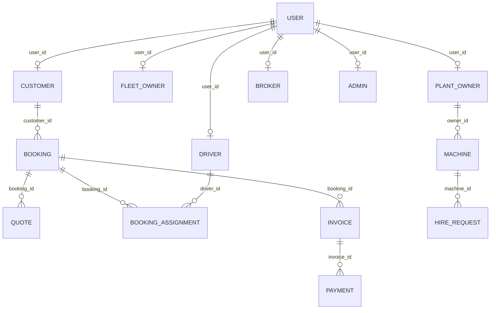

# Database Documentation

## Database Entity Relationship Diagram (ERD)

---

## Core Models Reference

### 1. User
- **Purpose**: Unified credential store and status management for all platform roles.
- **Key Fields**:
  - `id` (UUID, Primary Key)
  - `email` (String, Unique)
  - `password` (String, Hashed)
  - `role` (Enum: ADMIN, CUSTOMER, DRIVER, FLEET_OWNER, PLANT_OWNER, BROKER)
  - `status` (String, default: "ACTIVE")
  - `is_verified` (Boolean, default: false)

---

### 2. Customer
- **Purpose**: Holds profile metadata for client shippers.
- **Key Fields**:
  - `id` (UUID, Primary Key)
  - `user_id` (UUID, Foreign Key referencing User.id)
  - `company_name` (String, Optional)
  - `tax_number` (String, Optional)

---

### 3. Driver
- **Purpose**: Profile and verification information for cargo vehicle drivers.
- **Key Fields**:
  - `id` (UUID, Primary Key)
  - `user_id` (UUID, Foreign Key referencing User.id)
  - `license_number` (String)
  - `is_available` (Boolean, default: true)

---

### 4. Booking
- **Purpose**: Stores transport load details, cargo description, and routing coordinates.
- **Key Fields**:
  - `id` (UUID, Primary Key)
  - `customer_id` (UUID, Foreign Key referencing Customer.id)
  - `cargo_name` (String)
  - `weight` (Decimal)
  - `pickup_address` (String)
  - `delivery_address` (String)
  - `status` (Enum: PENDING, QUOTED, ASSIGNED, IN_TRANSIT, DELIVERED, COMPLETED, CANCELLED)

---

### 5. Quote
- **Purpose**: Broker proposal bids submitted to customers.
- **Key Fields**:
  - `id` (UUID, Primary Key)
  - `booking_id` (UUID, Foreign Key referencing Booking.id)
  - `broker_id` (UUID, Foreign Key referencing Broker.id)
  - `amount` (Decimal)
  - `status` (Enum: PENDING, ACCEPTED, REJECTED, EXPIRED)

---

### 6. HireRequest
- **Purpose**: Heavy plant machine rental contract requests.
- **Key Fields**:
  - `id` (UUID, Primary Key)
  - `machine_id` (UUID, Foreign Key referencing Machine.id)
  - `customer_id` (UUID, Foreign Key referencing Customer.id)
  - `status` (Enum: PENDING, APPROVED, ACTIVE, COMPLETED, REJECTED)
