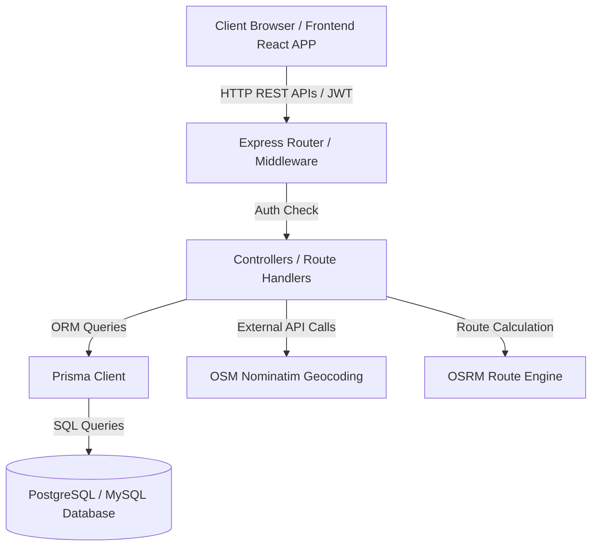

# System Architecture

## Architecture Overview
LoadAfrica follows a classic decoupled client-server architecture. The frontend application interacts with the backend server via HTTP REST APIs.

---

## Frontend Architecture
- **Framework**: Vite-powered React.js single-page application (SPA).
- **Routing**: `react-router-dom` using nested layouts (`CustomerLayout`, `BrokerLayout`, `AdminLayout`).
- **State Management**: React `useState` hooks for local state, alongside mock database storage synchronization (`mockData.js`) in local storage to support offline-first simulation.
- **Styling**: TailwindCSS utility classes.

---

## Backend Architecture
- **Framework**: Express.js server running in Node.js.
- **Database Access**: Prisma ORM, utilizing migrations and model mapping.
- **Authentication**: Stateful session/JWT validation checked by routing middleware.
- **External Interfaces**: Nominatim OpenStreetMap API for location geocoding and OSRM routing engine to estimate distance/duration.

---

## Folder Relationships & Workflow Lifecycle
1. **Client Interaction**: User triggers form submission on the React page.
2. **API Dispatch**: Request passes via client services (`bookingService.js`, `authService.js`) to backend endpoints.
3. **Route & Auth Middleware**: Backend matches route (`bookingRoutes.js`) and validates session token.
4. **Controller Logic**: Controller (`bookingController.js`) processes inputs, sanitizes variables, and interacts with Prisma DB.
5. **Response Cycle**: JSON response returns to client, triggering React state update and visual UI rendering.
