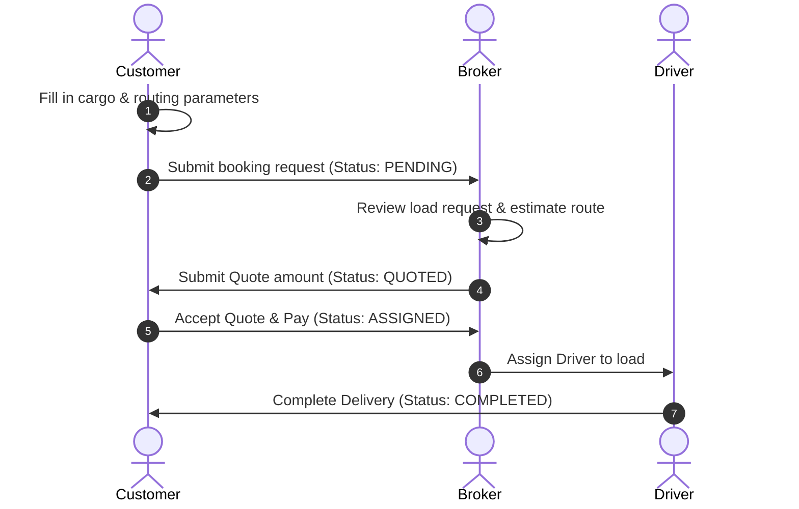
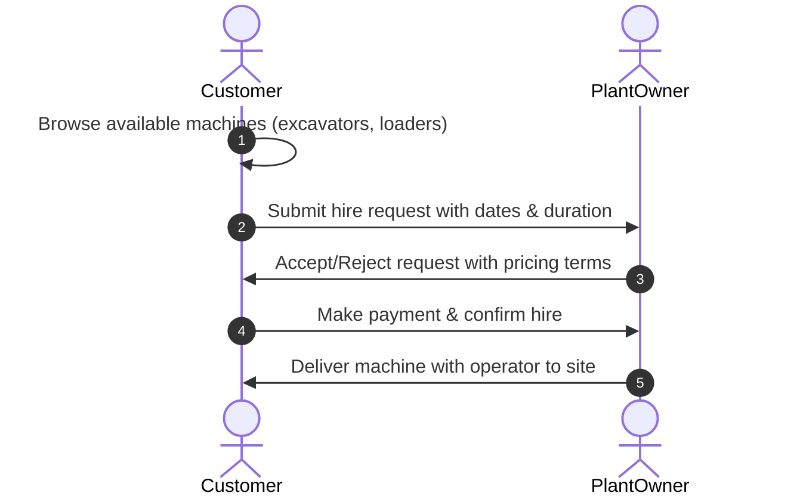

# User Workflows

This document describes the key user workflows within the LoadAfrica platform.

---

## 1. Transport Booking Workflow

---

## 2. Yellow Plant Hire Workflow

---

## 3. Core Workflow Status Lifecycles

### Transport Bookings
- **PENDING**: Customer created booking. Awaiting broker review.
- **QUOTED**: Broker calculated pricing and sent quote.
- **ASSIGNED**: Customer accepted quote. Awaiting driver/vehicle assignment.
- **IN_TRANSIT**: Driver dispatched. Real-time telemetry tracking active.
- **DELIVERED**: Cargo unloaded at destination.
- **COMPLETED**: Customer confirmed delivery. Commission credited to broker.
